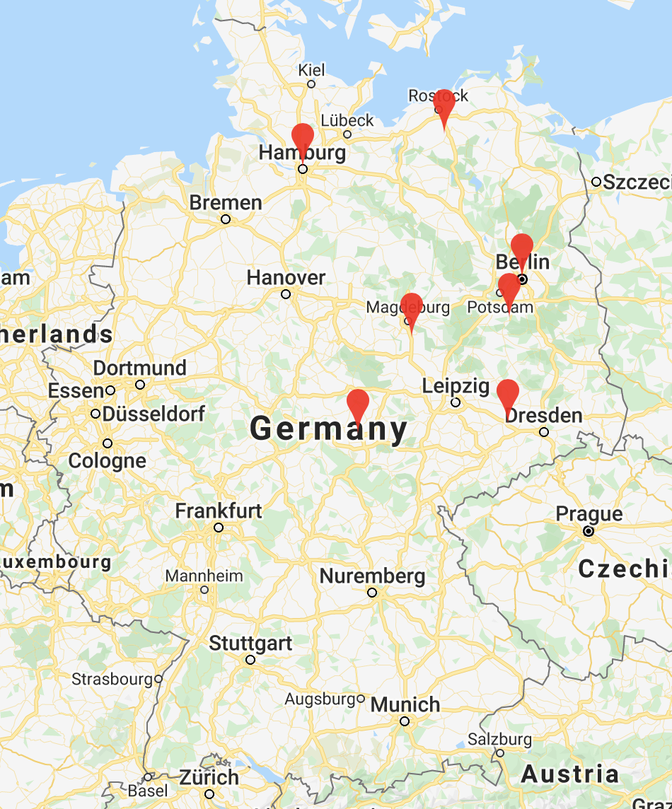
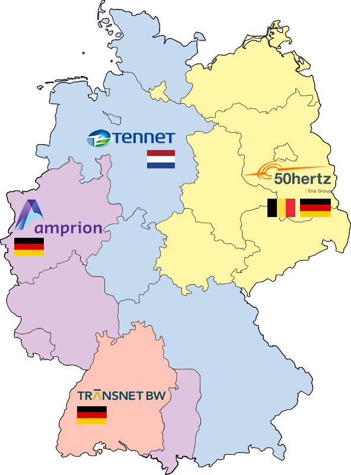

``` {r setup, include=FALSE}
library(data.table)
library(lubridate, warn.conflicts = FALSE)
library(knitr)
library(leaflet)
library(suncalc)
library(dplyr)
library(stringr)
library(tsibble)
library(anomalize)
library(feasts)
library(ggrepel)
library(ggplot2)
library(imputeTS)
library(nortest)
library(plotly)
library(rstatix)
library(tidyr)
library(rstan)
library(prophet)
library(rstan)
library(hydroGOF)
library(MLmetrics)

knitr::opts_chunk$set(echo=FALSE, message=FALSE, warning=FALSE)

options(lat=52.52)
options(lon=13.405)
options(tz="Europe/Minsk")
```

## Introduction

The data used in study is taken from [50hertz.com](<https://www.50hertz.com/en/Transparency/GridData/Production/Gridfeed-in>)

```{r, echo=TRUE, cache=FALSE}
data <- lapply(list.files(path ="./Input/50Hertz", full.name=TRUE), fread, skip=4, header=TRUE)
data <- rbindlist(data)
# Drop useless column
data[, V5:=NULL]
# Set column names 
setnames(data, c("Datum", "Von", "bis", "MW"), c("measurement_date", "from", "to", "MW"))
# Adding datetime columns
data[, from:=paste(measurement_date, from)] 
data[, to:=paste(measurement_date, to)] 
# Dropping date column
data[, measurement_date:=NULL]
# Parsing string to DateTime
data$from <- parse_date_time(data$from, "%d.%m.%y %H:%M", tz=getOption("tz"))
data$to <- parse_date_time(data$to, "%d.%m.%y %H:%M", tz=getOption("tz"))
data[format(to, "%H:%M") == "00:00", to:=to + days(1)]

```

The dataset contains `r nrow(data)` measurements of MW, collected from `r format(min(data$from),"%Y")` till `r format(max(data$from), "%Y")`.

```{r, echo=FALSE, results='asis', cache=TRUE}
kable(head(data, 3), caption="Head of table")
```

### Choosing one DateTime column for next analysis

Let's choose `to` as datetime

```{r echo=FALSE}
data[, from:=NULL]
setnames(data, c("to", "MW"), c("measurement_date", "MW"))
```

```{r, echo=FALSE, results='asis'}
kable(head(data, 3), caption="Head of table")
```

### Control Area

50Hertz is a transmission system operator for the north-east of Germany.

Main consumers of 50Hertz in Germany  are:

* Berlin 
* Brandenburg
* Hamburg
* Mecklenburg-Western 
* Pomerania
* Saxony
* Saxony-Anhalt
* Thuringia 

```{r leaflet, echo=FALSE}
df <- data.frame(lat= c(52.1415206727, 53.8597053732, 
                        51.11970740687, 51.96420900403,
                        51.02849903373, 52.52322778591,
                        53.5527796328), 
                 long=c(13.21602099583, 12.18626079162, 
                        13.19260388194, 11.68676803184,
                        10.8475875718, 13.39998632959,
                        9.99373294450))
df %>%
  leaflet( width = 900) %>%
  addTiles() %>%
  addMarkers(clusterOptions = markerClusterOptions(), 
             popup = c("Brandenburg", "Mecklenburg-Western Pomerania", "Saxony", "Saxony-Anhalt", "Thuringia", "Berlin", "Hamburg"))
```


{width=60%}{width=40%}

### Choosing area for light/dark time of day and weather data
Let's choose Berlin as basis for linkage weather and sunrise/sunset data. Because it's located in the center of the north-eastern part of Germany.

```{r light_dark, echo=TRUE}
data <- mutate(data,
       is_light = if_else(measurement_date %between% 
                          select(getSunlightTimes(date = as.Date(measurement_date), 
                                 lat = getOption("lat"), 
                                 lon = getOption("lon"), keep=c("sunrise", "sunset"), 
                                 tz=getOption("tz")), sunrise, sunset), TRUE, FALSE)
)
kable(head(data, 3), caption="Head of table")
```

### Weather data nonnumerical columns exploration
```{r weather_date, echo=FALSE}

weather_data <- fread("./Input/Weather/Weather.csv", skip=6)
weather_data[, `:=`(V14 = NULL, ff10 = NULL, "W'W'" = NULL)]
setnames(weather_data, c("Local time in Berlin / Schoenefeld (airport)"), c("m_date"))
weather_data$m_date <- parse_date_time(weather_data$m_date, "%d.%m.%y %H:%M", tz=getOption("tz"))

weather_data %>% 
  group_by(DD) %>% 
  summarise(
    number=n()
  )

weather_data %>% 
  group_by(WW) %>% 
  summarise(
    number=n()
  )

weather_data %>% 
  group_by(c=str_extract(c, "[[:alpha:][:space:]]+")) %>% 
  summarise(
    number=n()
  )
```


### Merge weather data

* **T** - Air temperature (degrees Celsius) at 2 metre height above the earth's surface;
* **P0** - Atmospheric pressure at weather station level (millimeters of mercury);
* **P** - Atmospheric pressure reduced to mean sea level (millimeters of mercury);
* **U** - Relative humidity (%) at a height of 2 metres above the earth\'s surface;
* **DD** - Mean wind direction (compass points) at a height of 10-12 metres above the earth’s surface over the 10-minute period immediately preceding the observation;
* **Ff** - Mean wind speed at a height of 10-12 metres above the earth’s surface over the 10-minute period immediately preceding the observation (meters per second);
* **WW** - Special present weather phenomena observed at or near the aerodrome;
* **c** - Total cloud cover;
* **VV** - Horizontal visibility (km);
* **Td** - Dewpoint temperature at a height of 2 metres above the earth's surface (degrees Celsius);

```{r weather, echo=TRUE}
weather_data[, `:=`(WW=NULL, c=NULL, DD=NULL)]
setkey(data, measurement_date)
setkey(weather_data, m_date)
data <- weather_data[data, roll="nearest"]
setnames(data, c("m_date"), c("measurement_date"))
kable(head(data, 3), caption="Head of table")
```


### Data quality

```{r data_quality, echo=TRUE}
kable(
data %>% 
  summarize_all(
    ~ sum(is.na(.))), 
caption="Missing values")

data <- data %>% 
  mutate(T = na_locf(T),
         P0 = na_locf(P0),
         U = na_locf(U),
         Ff = na_locf(Ff),
         Td = na_locf(Td),
         VV = na_locf(VV))
data <- data[!are_duplicated(data, index=measurement_date)]
```

## Data exploration

### Outliers Y & X
```{r outliers, echo=TRUE, cache=TRUE}

data_tsbl <- as_tsibble(data, key=NULL, index = measurement_date)

data_daily <- data_tsbl %>% 
  index_by(dt = as.Date(measurement_date)) %>% 
  summarise(MW = mean(MW)) %>% 
  fill_gaps() %>% 
  mutate(MW = forecast::na.interp(MW))

data_daily %>%
  model(STL(MW ~ trend(window = 365) + season(period = "year"))) %>%
  components() %>% 
  autoplot() + theme_minimal()


data_anomaly <- data_tsbl %>% 
  time_decompose(MW, frequency = "1 year", trend="1 year") %>% 
  anomalize(remainder, alpha = 0.05, max_anoms = 0.35) %>% 
  time_recompose()

data_anomaly %>% plot_anomaly_decomposition(size_dots=0.2)

data_anomaly <- data_tsbl %>% 
  time_decompose(MW, frequency = "1 year", trend="1 year", method="twitter") %>% 
  anomalize(remainder, alpha = 0.05, max_anoms = 0.35) %>% 
  time_recompose()

data_anomaly %>% plot_anomaly_decomposition(size_dots=0.2)
```

### Normality Y

#### QQ-plot


``` {r qq_plot, echo=FALSE, cache=TRUE}
p <- ggplot(data, aes(sample = MW)) + geom_qq() + theme_minimal()
p + stat_qq() + stat_qq_line()
```

#### Anderson-Darling test

``` {r anderson_darling_test, echo=FALSE, cache=TRUE}
ad.test(data$MW)
```

Результаты теста на нормальность статистически значимы (p-value < $2.2\cdot10^{-16}$), таким образом, нулевая гипотеза о нормальности выборки в данном случае отвергается.

Ниже представлены результаты применения теста для различных групп (день/ночь + месяц). Все результаты получились статистически значимыми, то есть принимается альтернативная гипотеза.

``` {r anderson_darling_test_is_light, echo=FALSE, cache=TRUE}
data <- data %>% 
mutate(weekday = weekdays(measurement_date),
       month = month(measurement_date),
       season = ifelse(month %in% 3:5, "Spring",
                       ifelse(month %in% 6:8, "Summer",
                              ifelse(month %in% 9:11, "Fall",
                                     "Winter"))))
data$weekday <- factor(data$weekday, 
                              levels=c("Monday", "Tuesday", "Wednesday", 
                                       "Thursday", "Friday", "Saturday", "Sunday"))

data$season <- factor(data$season, 
                              levels=c("Winter", "Spring", "Summer", "Fall"))

aggregate(. ~ is_light+month, data = data[, c("MW", "is_light", "month")], function(x) ad.test(x)$p.value)

```


#### Violin plot
##### Время суток
Так как $p$-value > 0.05, то мы не имеем оснований отвергнуть нулевую гипотезу о равенстве средних значений двух групп: 'темное' и 'светлое' времена суток.

``` {r violin_plot_MW_is_light, echo=FALSE, cache=TRUE}
summary(aov(MW ~ is_light, data=data))

kruskal.test(MW ~ is_light, data=data)

fig <- data %>% 
  plot_ly(
    x=~is_light,
    y=~MW,
    split=~is_light,
    type='violin',
    box=list(
      visible=TRUE
    ),
    meanline=list(
      visible=TRUE
    ),
    width=800, height=600
  )

fig <- fig %>% 
  layout(
    xaxis=list(
      title="is light"
    ),
    yaxis=list(
      title="MW",
      zeroline=FALSE
    )
  )

fig %>%
  layout(colorway = c('#0A0680','#EBE300'))

pairwise.wilcox.test(data$MW, data$is_light, p.adj="holm", exact=FALSE)

wilcox_effsize(MW~is_light, data=data)
```

Тест Краскела-Уоллиса выявил статистически значимые различия между признаками `is_light` на `MW` ($\chi^2(1)=26.057, p<0.05$). Post-hoc тест на основе теста Манна-Уитни с корректировкой Холма выявил значимые различия между группами `TRUE` и `FALSE` ($p < 0.05, r = 0.01$).

##### Время года

``` {r violin_plot_MW_season, echo=FALSE, cache=TRUE}
summary(aov(MW ~ season, data=data))

kruskal.test(MW ~ season, data=data)

fig <- data %>% 
  plot_ly(
      x=~season,
    y=~MW,
    split=~season,
    type='violin',
    box=list(
      visible=TRUE
    ),
    meanline=list(
      visible=TRUE
    ),
    width=800, height=600
  )

fig <- fig %>% 
  layout(
    xaxis=list(
      title="Season"
    ),
    yaxis=list(
      title="MW",
      zeroline=FALSE
    )
  )

fig %>%
  layout(colorway = c('#097AEB','#09EB18','#DCEB09','#EBB609'))

pairwise.wilcox.test(data$MW, data$season, p.adj="holm", exact=FALSE)

pairwise.t.test(data$MW, data$season, p.adjust.method = "holm")

wilcox_effsize(MW~season, data=data)
```


Тест Краскела-Уоллиса выявил значимый эффект признака `MW` на `season` ($\chi^2(3)=44346, p < 0.05$). Post-hoc тест на основе теста Манна-Уитни с корректировкой Холма выявил значимые различия между группами `Winter` и `Spring` ($p < 0.05, r = 0.38$), `Winter` и `Summer` ($p < 0.05, r = 0.58$), `Winter` и `Fall` ($p < 0.05, r = 0.26$), `Spring` и `Summer` ($p < 0.05, r = 0.21$), `Spring` и `Fall` ($p < 0.05, r = 0.15$), `Summer` и `Spring` ($p < 0.05, r = 0.39$).

##### День недели
``` {r violin_plot_MW_weekday, echo=FALSE, cache=TRUE}
summary(aov(MW ~ weekday, data=data))

kruskal.test(MW ~ weekday, data=data)

fig <- data %>% 
  plot_ly(
    x=~weekday,
    y=~MW,
    split=~weekday,
    type='violin',
    box=list(
      visible=TRUE
    ),
    meanline=list(
      visible=TRUE
    ),
    width=800, height=600
  )

fig <- fig %>% 
  layout(
    xaxis=list(
      title="Weekday"
    ),
    yaxis=list(
      title="MW",
      zeroline=FALSE
    )
  )

fig %>%
  layout(colorway = c('#3609EB','#22CD1C','#22CD1C','#22CD1C','#C509EB',
                      "#3567F3", "#063380"))

aggregate(. ~ is_light+weekday, data = data[, c("MW", "is_light", "weekday")], function(x) ad.test(x)$p.value)

pairwise.wilcox.test(data$MW, data$weekday, p.adj="holm", exact=FALSE)

pairwise.t.test(data$MW, data$weekday, p.adjust.method = "holm")

wilcox_effsize(MW~weekday, data=data)
```

Тест Краскела-Уоллиса выявил значимый эффект признака `MW` на `weekday` ($\chi^2(6)=13971, p < 0.05$). Post-hoc тест на основе теста Манна-Уитни с корректировкой Холма выявил значимые различия между всеми сезонами, кроме сочетания `Tuesday` и `Thursday` ($p = 0.52, r = 0.01$)


``` {r violin_plot_MW_season_weekday, warning=FALSE, cache=TRUE}
fig <- data %>% 
  plot_ly(type="violin", width=800, height=600)
fig <- fig %>% 
  add_trace(
    x = ~season[data$is_light == TRUE],
    y = ~MW[data$is_light == TRUE],
    legendgroup = "day",
    scalegroup = "day",
    side = "negative",
    name = "day",
    box = list(
      visible = TRUE
    ),
    meanline = list(
      visible = TRUE
    ), 
    color = I("green")
  )
fig <- fig %>% 
  add_trace(
    x = ~season[data$is_light == FALSE],
    y = ~MW[data$is_light == FALSE],
    legendgroup = "night",
    scalegroup = "night",
    side = "positive",
    name = "night",
    box = list(
      visible = TRUE
    ),
    meanline = list(
      visible=TRUE
    ),
    color = I("blue")
  )
fig <- fig %>% 
  layout(
    xaxis = list(
      title="Season/is_light"
    ),
    yaxis = list(
      zeroline = FALSE,
      title="MW"
    ),
    violinmode = "overlay",
    violingap = 0,
    violingroupgap = 0
  )

fig
```


### Homogeneity Y
```{r homogeneity, echo=FALSE, cache=TRUE}
summary(aov(MW ~ is_light, data))
summary(aov(MW ~ season, data))
summary(aov(MW ~ weekday, data))
```

### Lockdown

``` {r lockdown, echo=FALSE}
lockdown <- fread('Input/Lockdown/lockdown.csv', header=TRUE)
data[, date:=as.Date(data$measurement_date)]
lockdown[, date:=as.Date(lockdown$date)]
data <- lockdown[data, on='date']
data[, date:=NULL]
data[, weekday:=NULL]
data[, month:=NULL]
data[, season:=NULL]
data[VV == '10.0 and more', VV:="10"]


data <- data %>% 
  replace_na(list(school = 0,
                  school_flag=0,
                  workplace=0,
                  workplace_flag=0,
                  stay_home=0,
                  stay_home_flag=0,
                  borders=0))
head(data, 3)
```


## Forecasting
#### Prophet

Для начала применим `Prophet` на наши данные в лоб.
``` {r prophet_plot_function, echo=FALSE, cache=FALSE}

custom_plot <- function(x, fcst, df_test, days = 30, uncertainty = TRUE, plot_cap = TRUE,
                        xlabel = 'ds', ylabel = 'y', ...) {
  df <- df_for_plotting(x, fcst)
  
  
  
  if (is.null(df_test)) {
    right_bound <- tail(fcst$ds, 1)
    left_bound <- head(fcst$ds, 1)
  } else {
    right_bound <- tail(df_test$ds, 1)
    left_bound <- right_bound - as.difftime(days, unit="days")
  }
  
  gg <- ggplot2::ggplot(df, ggplot2::aes(x = ds, y = y)) +
    ggplot2::labs(x = xlabel, y = ylabel) +
    ggplot2::lims(x=c(left_bound, 
                      right_bound))
  if (exists('cap', where = df) && plot_cap) {
    gg <- gg + ggplot2::geom_line(
      ggplot2::aes(y = cap), linetype = 'dashed', na.rm = TRUE)
  }
  if (x$logistic.floor && exists('floor', where = df) && plot_cap) {
    gg <- gg + ggplot2::geom_line(
      ggplot2::aes(y = floor), linetype = 'dashed', na.rm = TRUE)
  }
  if (uncertainty && x$uncertainty.samples && exists('yhat_lower', where = df)) {
    gg <- gg +
      ggplot2::geom_ribbon(ggplot2::aes(ymin = yhat_lower, ymax = yhat_upper),
                           alpha = 0.5,
                           fill = "#6AB693",
                           na.rm = TRUE)
  }
  if (!is.null(df_test)) {
    gg <- gg + geom_line(data=data_test, 
              aes(x=ds, y=y), 
              na.rm=TRUE, 
              color="#0B289E")
    
  }
  gg <- gg +
    theme_minimal() +
    ggplot2::geom_point(na.rm=TRUE,
                        size=0.6) +
    ggplot2::geom_line(ggplot2::aes(y = yhat), 
                       color = "#04693A",
                       na.rm = TRUE) +
    ggplot2::theme(aspect.ratio = 3 / 5) 
  return(gg)
}


df_for_plotting <- function(m, fcst) {
  fcst$y <- NULL
  df <- m$history %>%
    dplyr::select(ds, y) %>%
    dplyr::full_join(fcst, by = "ds") %>%
    dplyr::arrange(ds)
  return(df)
}
```

``` {r prophet_basic, cache=TRUE}
  data <- data[minute(data$measurement_date) == 0]


  data_train <- data %>% 
    select(ds = measurement_date, y = MW) %>% 
    slice(1:(n() - 24 * 3)) %>% 
    as.data.frame()
  
  data_test <- data %>% 
    select(ds = measurement_date, y = MW) %>% 
    tail(24*3) %>% 
    as.data.frame()


model <- prophet(growth = "linear",
                 changepoints = NULL,
                 n.changepoints = 25,
                 changepoint.range = 0.9, 
                 changepoint.prior.scale = 0.02)        

model <- add_country_holidays(m = model, country_name="DE")

model <- fit.prophet(model, data_train)

future_df <- make_future_dataframe(model, periods = 3 * 24, 
                                   freq=60*60, include_history = TRUE)
forecast <- predict(model, future_df)
```

``` {r prophet_basic_CV, cache=TRUE}

  model_CV <- cross_validation(model, 
                   initial = 3 * 365 * 24,
                   horizon =  90 * 24,
                   period = 90 * 24,
                   units= "hours"
                   )

  model_metrics <- performance_metrics(model_CV, 
                                       metrics=c("mse", "rmse", "mae", "mape"),
                                       rolling_window = 0)

  plot_cross_validation_metric(model_CV, metric = "mse",
                               rolling_window = 0)
  
  head(model_metrics)
```

``` {r prophet_basic_plot, cache=TRUE, out.height="100%", out.width="100%"}

custom_plot(model, forecast, NULL, days=60) + 
  add_changepoints_to_plot(model)

custom_plot(model, forecast, data_test, days=1000) + 
  add_changepoints_to_plot(model)

custom_plot(model, forecast, data_test, days=60) + 
  add_changepoints_to_plot(model)
```

``` {r prophet_basic_plot_components, cache=TRUE, echo=FALSE, out.height="100%", out.width="100%"}
prophet_plot_components(model, forecast)

```

Добавим в качестве предиктора температуру и `is_light` в виде условного режима сезонности, а также праздники Германии.

``` {r prophet_regressors, cache=TRUE}
data_train <- data %>% 
  select(ds = measurement_date, y = MW, t=T, is_light=is_light) %>% 
  slice(1:(n() - 3 * 24)) %>% 
  as.data.frame()

data_test <- data %>% 
  select(ds = measurement_date, y = MW, t=T, is_light=is_light) %>% 
  tail(3 * 24) %>% 
  as.data.frame()

model_regressors <- prophet(growth = "linear",
                 changepoints = NULL,
                 n.changepoints = 25,
                 changepoint.range = 0.9, 
                 changepoint.prior.scale = 0.02) 

model_regressors <- add_country_holidays(m = model_regressors, country_name="DE")

model_regressors <- add_regressor(model_regressors, 't')

model_regressors <- add_seasonality(model_regressors, 
                         name = 'is_light',
                         period = 1,
                         fourier.order = 5,
                         condition.name = 'is_light')

model_regressors <- fit.prophet(model_regressors, data_train)

future_df <- data %>% 
  select(ds = measurement_date,
         t = T,
         is_light = is_light) %>% 
  as.data.frame() 

forecast <- predict(model_regressors, future_df)
```

``` {r prophet_regressors_CV, cache=TRUE}

  model_regressors_CV <- cross_validation(model_regressors, 
                   initial = 3 * 365 * 24,
                   horizon =  365 * 24,
                   period = 180 * 24,
                   units= "hours"
                   )

  model_metrics <- performance_metrics(model_regressors_CV, 
                                       metrics=c("mse", "rmse", "mae", "mape"),
                                       rolling_window = 0)

  plot_cross_validation_metric(model_regressors_CV, metric = "mse",
                               rolling_window = 0)
  
  head(model_metrics)
```

``` {r prophet_regressors_plot, cache=TRUE, out.height="100%", out.width="100%"}

custom_plot(model_regressors, forecast, NULL, days=60) + 
  add_changepoints_to_plot(model_regressors)

custom_plot(model_regressors, forecast, data_test, days=1000) + 
  add_changepoints_to_plot(model_regressors)

custom_plot(model_regressors, forecast, data_test, days=60) + 
  add_changepoints_to_plot(model_regressors)
```

``` {r prophet_regressors_plot_components, cache=TRUE, echo=FALSE, out.height="100%", out.width="100%"}
prophet_plot_components(model_regressors, forecast)
```

Видно, что точность модели улучшилась, а также тренд стал линейным нисходящим,попробуем посмотреть поближе на графики температуры.

``` {r prophet_t, cache=TRUE}
data_train <- data %>% 
  select(ds = measurement_date, y = T) %>% 
  slice(1:(n() - 3 * 24)) %>% 
  as.data.frame()

data_test <- data %>% 
  select(ds = measurement_date, y = T) %>% 
  tail(3 * 24) %>% 
  as.data.frame()

model_t <- prophet(growth = "linear",
                 changepoints = NULL,
                 n.changepoints = 25,
                 changepoint.range = 0.9, 
                 changepoint.prior.scale = 0.02) 

model_t <- fit.prophet(model_t, data_train)

future_df <- make_future_dataframe(model_t, periods = 3 * 24, 
                                   freq=60*60, include_history = TRUE)

forecast <- predict(model_t, future_df)
```

``` {r prophet_t_plot, cache=TRUE, out.height="100%", out.width="100%"}

custom_plot(model_t, forecast, NULL, days=60) + 
  add_changepoints_to_plot(model_t)

custom_plot(model_t, forecast, data_test, days=1000) + 
  add_changepoints_to_plot(model_t)

custom_plot(model_t, forecast, data_test, days=60) + 
  add_changepoints_to_plot(model_t)
```

``` {r prophet_t_plot_components, cache=TRUE, echo=FALSE, out.height="100%", out.width="100%"}
prophet_plot_components(model_t, forecast)
```

Видно, что паттерны изменения температуры похожи на график предсказываемого значения `MW`.

Попробуем добавить в модель данные о локдауне.

``` {r prophet_lockdown, cache=TRUE}
data_train <- data %>% 
  select(ds = measurement_date, 
         y = MW, 
         t=T, 
         is_light=is_light,
         school=school,
         school_flag=school_flag,
         workplace=workplace,
         workplace_flag=workplace_flag,
         stay_home=stay_home,
         stay_home_flag=stay_home_flag,
         borders=borders,
         Ff=Ff) %>% 
  slice(1:(n() - 3 * 24)) %>% 
  as.data.frame()

data_test <- data %>% 
  select(ds = measurement_date, y = MW, t=T, is_light=is_light) %>% 
  tail(3 * 24) %>% 
  as.data.frame()

model_lockdown <- prophet(growth = "linear",
                 changepoints = NULL,
                 n.changepoints = 25,
                 changepoint.range = 0.7, 
                 changepoint.prior.scale = 0.05) 

model_lockdown <- add_country_holidays(m = model_lockdown, country_name="DE")

model_lockdown <- add_regressor(model_lockdown, 't')
model_lockdown <- add_regressor(model_lockdown, 'school')
model_lockdown <- add_regressor(model_lockdown, 'school_flag')
model_lockdown <- add_regressor(model_lockdown, 'workplace')
model_lockdown <- add_regressor(model_lockdown, 'workplace_flag')
model_lockdown <- add_regressor(model_lockdown, 'stay_home')
model_lockdown <- add_regressor(model_lockdown, 'stay_home_flag')
model_lockdown <- add_regressor(model_lockdown, 'borders')
model_lockdown <- add_regressor(model_lockdown, 'Ff')


model_lockdown <- add_seasonality(model_lockdown, 
                         name = 'is_light',
                         period = 1,
                         fourier.order = 5,
                         condition.name = 'is_light')

model_lockdown <- fit.prophet(model_lockdown, data_train)

future_df <- data %>% 
  select(ds = measurement_date,
         t = T,
         is_light = is_light,
         school=school,
         school_flag=school_flag,
         workplace=workplace,
         workplace_flag=workplace_flag,
         stay_home=stay_home,
         stay_home_flag=stay_home_flag,
         borders=borders,
         Ff=Ff) %>% 
  as.data.frame() 

forecast <- predict(model_lockdown, future_df)
```

``` {r prophet_lockdown_CV, cache=TRUE}

  model_lockdown_CV <- cross_validation(model_lockdown, 
                   initial = 3 * 365 * 24,
                   horizon =  365 * 24,
                   period = 180 * 24,
                   units= "hours"
                   )

  model_metrics <- performance_metrics(model_lockdown_CV, 
                                       metrics=c("mse", "rmse", "mae", "mape"),
                                       rolling_window = 0)

  plot_cross_validation_metric(model_lockdown_CV, metric = "mse",
                               rolling_window = 0)
  
  head(model_metrics)
```

``` {r prophet_lockdown_plot, cache=TRUE, out.height="100%", out.width="100%"}

custom_plot(model_lockdown, forecast, NULL, days=60) + 
  add_changepoints_to_plot(model_lockdown)

custom_plot(model_lockdown, forecast, data_test, days=1000) + 
  add_changepoints_to_plot(model_lockdown)

custom_plot(model_lockdown, forecast, data_test, days=60) + 
  add_changepoints_to_plot(model_lockdown)
```

``` {r prophet_lockdown_plot_components, cache=TRUE, echo=FALSE, out.height="100%", out.width="100%"}
prophet_plot_components(model_lockdown, forecast)
```

Tune

``` {r prophet_lockdown_tuned, cache=TRUE}
data_train <- data %>% 
  select(ds = measurement_date, 
         y = MW, 
         t=T, 
         is_light=is_light,
         school=school,
         school_flag=school_flag,
         workplace=workplace,
         workplace_flag=workplace_flag,
         stay_home=stay_home,
         stay_home_flag=stay_home_flag,
         borders=borders,
         Ff=Ff) %>% 
  slice(1:(n() - 3 * 24)) %>% 
  as.data.frame()

data_test <- data %>% 
  select(ds = measurement_date, y = MW, t=T, is_light=is_light) %>% 
  tail(3 * 24) %>% 
  as.data.frame()

model_lockdown_tuned <- prophet(growth = "linear",
                 changepoints = NULL,
                 n.changepoints = 25,
                 changepoint.range = 0.7, 
                 changepoint.prior.scale = 0.07,
                 holidays.prior.scale = 40,
                 seasonality.prior.scale = 30,
                 seasonality.mode = "additive") 

model_lockdown_tuned <- add_country_holidays(m = model_lockdown_tuned, country_name="DE")

model_lockdown_tuned <- add_regressor(model_lockdown_tuned, 't')
model_lockdown_tuned <- add_regressor(model_lockdown_tuned, 'school')
model_lockdown_tuned <- add_regressor(model_lockdown_tuned, 'school_flag')
model_lockdown_tuned <- add_regressor(model_lockdown_tuned, 'workplace')
model_lockdown_tuned <- add_regressor(model_lockdown_tuned, 'workplace_flag')
model_lockdown_tuned <- add_regressor(model_lockdown_tuned, 'stay_home')
model_lockdown_tuned <- add_regressor(model_lockdown_tuned, 'stay_home_flag')
model_lockdown_tuned <- add_regressor(model_lockdown_tuned, 'borders')
model_lockdown_tuned <- add_regressor(model_lockdown_tuned, 'Ff')


model_lockdown_tuned <- add_seasonality(model_lockdown_tuned, 
                         name = 'is_light',
                         period = 1,
                         fourier.order = 8,
                         condition.name = 'is_light')

model_lockdown_tuned <- fit.prophet(model_lockdown_tuned, data_train)

future_df <- data %>% 
  select(ds = measurement_date,
         t = T,
         is_light = is_light,
         school=school,
         school_flag=school_flag,
         workplace=workplace,
         workplace_flag=workplace_flag,
         stay_home=stay_home,
         stay_home_flag=stay_home_flag,
         borders=borders,
         Ff=Ff,
         VV=VV) %>% 
  as.data.frame() 

forecast <- predict(model_lockdown_tuned, future_df)
```

``` {r prophet_lockdown_tuned_CV, cache=TRUE}

  model_lockdown_tuned_CV <- cross_validation(model_lockdown_tuned, 
                   initial = 3 * 365 * 24,
                   horizon =  365 * 24,
                   period = 180 * 24,
                   units= "hours"
                   )

  model_metrics <- performance_metrics(model_lockdown_tuned_CV, 
                                       metrics=c("mse", "rmse", "mae", "mape"),
                                       rolling_window = 0)

  plot_cross_validation_metric(model_lockdown_tuned_CV, metric = "mse",
                               rolling_window = 0)
  
  head(model_metrics)
```

``` {r prophet_lockdown_tuned_plot, cache=TRUE, out.height="100%", out.width="100%"}

custom_plot(model_lockdown_tuned, forecast, NULL, days=60) + 
  add_changepoints_to_plot(model_lockdown_tuned)

custom_plot(model_lockdown_tuned, forecast, data_test, days=1000) + 
  add_changepoints_to_plot(model_lockdown_tuned)

custom_plot(model_lockdown_tuned, forecast, data_test, days=60) + 
  add_changepoints_to_plot(model_lockdown_tuned)
```

``` {r prophet_lockdown_tuned_plot_components, cache=TRUE, echo=FALSE, out.height="100%", out.width="100%"}
prophet_plot_components(model_lockdown_tuned, forecast)
```


Tune1

``` {r prophet_lockdown_tuned1, cache=TRUE}


data_train <- data %>% 
  select(ds = measurement_date, 
         y = MW, 
         t=T, 
         is_light=is_light,
         school=school,
         school_flag=school_flag,
         workplace=workplace,
         workplace_flag=workplace_flag,
         stay_home=stay_home,
         stay_home_flag=stay_home_flag,
         borders=borders,
         Ff=Ff) %>% 
  slice(1:(n() - 3 * 24)) %>% 
  as.data.frame()

data_test <- data %>% 
  select(ds = measurement_date, y = MW, t=T, is_light=is_light) %>% 
  tail(3 * 24) %>% 
  as.data.frame()

model_lockdown_tuned1 <- prophet(growth = "linear",
                 changepoints = NULL,
                 n.changepoints = 25,
                 changepoint.range = 0.8, 
                 changepoint.prior.scale = 0.01,
                 holidays.prior.scale = 30,
                 seasonality.prior.scale = 20,
                 seasonality.mode = "additive") 

model_lockdown_tuned1 <- add_country_holidays(m = model_lockdown_tuned1, country_name="DE")

model_lockdown_tuned1 <- add_regressor(model_lockdown_tuned1, 't')
model_lockdown_tuned1 <- add_regressor(model_lockdown_tuned1, 'school')
model_lockdown_tuned1 <- add_regressor(model_lockdown_tuned1, 'school_flag')
model_lockdown_tuned1 <- add_regressor(model_lockdown_tuned1, 'workplace')
model_lockdown_tuned1 <- add_regressor(model_lockdown_tuned1, 'workplace_flag')
model_lockdown_tuned1 <- add_regressor(model_lockdown_tuned1, 'stay_home')
model_lockdown_tuned1 <- add_regressor(model_lockdown_tuned1, 'stay_home_flag')
model_lockdown_tuned1 <- add_regressor(model_lockdown_tuned1, 'borders')
model_lockdown_tuned1 <- add_regressor(model_lockdown_tuned1, 'Ff')


model_lockdown_tuned1 <- add_seasonality(model_lockdown_tuned1, 
                         name = 'is_light',
                         period = 1,
                         fourier.order = 8,
                         condition.name = 'is_light')

model_lockdown_tuned1 <- fit.prophet(model_lockdown_tuned1, data_train)

future_df <- data %>% 
  select(ds = measurement_date,
         t = T,
         is_light = is_light,
         school=school,
         school_flag=school_flag,
         workplace=workplace,
         workplace_flag=workplace_flag,
         stay_home=stay_home,
         stay_home_flag=stay_home_flag,
         borders=borders,
         Ff=Ff,
         VV=VV) %>% 
  as.data.frame() 

forecast <- predict(model_lockdown_tuned1, future_df)
```

``` {r prophet_lockdown_tuned1_CV, cache=TRUE}

  model_lockdown_tuned1_CV <- cross_validation(model_lockdown_tuned1, 
                   initial = 3 * 365 * 24,
                   horizon =  365 * 24,
                   period = 180 * 24,
                   units= "hours"
                   )


  model_metrics <- performance_metrics(model_lockdown_tuned1_CV, 
                                       metrics=c("mse", "rmse", "mae", "mape"),
                                       rolling_window = 0)

  plot_cross_validation_metric(model_lockdown_tuned1_CV, metric = "mse",
                               rolling_window = 0)
  
  head(model_metrics)
```

``` {r prophet_lockdown_tuned1_plot, cache=TRUE, out.height="100%", out.width="100%"}

custom_plot(model_lockdown_tuned1, forecast, NULL, days=60) + 
  add_changepoints_to_plot(model_lockdown_tuned1)


custom_plot(model_lockdown_tuned1, forecast, data_test, days=1000) + 
  add_changepoints_to_plot(model_lockdown_tuned1)

custom_plot(model_lockdown_tuned1, forecast, data_test, days=60) + 
  add_changepoints_to_plot(model_lockdown_tuned1)
```

``` {r prophet_lockdown_tuned1_plot_components, cache=TRUE, echo=FALSE, out.height="100%", out.width="100%"}

prophet_plot_components(model_lockdown_tuned1, forecast)
```

Add P0, U, Td, VV as regressors

``` {r fix_outliers, echo=FALSE, cache=TRUE}
data_tsbl <- as_tsibble(data, key=NULL, index = measurement_date)

data_daily <- data_tsbl %>% 
  index_by(dt = as.Date(measurement_date)) %>% 
  summarise(MW = mean(MW)) %>% 
  fill_gaps() %>% 
  mutate(MW = forecast::na.interp(MW))

data_daily %>%
  model(STL(MW ~ trend(window = 365) + season(period = "year"))) %>%
  components() %>% 
  autoplot() + theme_minimal()


data_anomaly <- data_tsbl %>% 
  time_decompose(MW, frequency = "1 year", trend="1 year") %>% 
  anomalize(remainder, alpha = 0.05, max_anoms = 0.35) %>% 
  time_recompose()

#data[data_anomaly$anomaly=='Yes']$MW = median(data$MW)
```

``` {r prophet_lockdown_tuned2, cache=TRUE}
data <- data %>% 
  mutate(VV = na_locf(strtoi(VV)))


data_train <- data %>% 
  select(ds = measurement_date, 
         y = MW, 
         t=T, 
         is_light=is_light,
         school=school,
         school_flag=school_flag,
         workplace=workplace,
         workplace_flag=workplace_flag,
         stay_home=stay_home,
         stay_home_flag=stay_home_flag,
         borders=borders,
         Ff=Ff,
         P0=P0,
         U=U,
         Td=Td,
         VV=VV) %>% 
  slice(1:(n() - 3 * 24)) %>% 
  as.data.frame()

data_test <- data %>% 
  select(ds = measurement_date, y = MW, t=T, is_light=is_light) %>% 
  tail(3 * 24) %>% 
  as.data.frame()

model_lockdown_tuned2 <- prophet(growth = "linear",
                 changepoints = NULL,
                 n.changepoints = 25,
                 changepoint.range = 0.8, 
                 changepoint.prior.scale = 0.01,
                 holidays.prior.scale = 30,
                 seasonality.prior.scale = 20,
                 seasonality.mode = "additive")  

model_lockdown_tuned2 <- add_country_holidays(m = model_lockdown_tuned2, country_name="DE")


model_lockdown_tuned2 <- add_regressor(model_lockdown_tuned2, 't')
model_lockdown_tuned2 <- add_regressor(model_lockdown_tuned2, 'school')
model_lockdown_tuned2 <- add_regressor(model_lockdown_tuned2, 'school_flag')
model_lockdown_tuned2 <- add_regressor(model_lockdown_tuned2, 'workplace')
model_lockdown_tuned2 <- add_regressor(model_lockdown_tuned2, 'workplace_flag')
model_lockdown_tuned2 <- add_regressor(model_lockdown_tuned2, 'stay_home')
model_lockdown_tuned2 <- add_regressor(model_lockdown_tuned2, 'stay_home_flag')
model_lockdown_tuned2 <- add_regressor(model_lockdown_tuned2, 'borders')
model_lockdown_tuned2 <- add_regressor(model_lockdown_tuned2, 'Ff')
#model_lockdown_tuned2 <- add_regressor(model_lockdown_tuned2, 'P0')
#model_lockdown_tuned2 <- add_regressor(model_lockdown_tuned2, 'U')
#model_lockdown_tuned2 <- add_regressor(model_lockdown_tuned2, 'Td')
#model_lockdown_tuned2 <- add_regressor(model_lockdown_tuned2, 'VV')


model_lockdown_tuned2 <- add_seasonality(model_lockdown_tuned2, 
                         name = 'is_light',
                         period = 1,
                         fourier.order = 8,
                         condition.name = 'is_light')

model_lockdown_tuned2 <- fit.prophet(model_lockdown_tuned2, data_train)

future_df <- data %>% 
  select(ds = measurement_date,
         t = T,
         is_light = is_light,
         school=school,
         school_flag=school_flag,
         workplace=workplace,
         workplace_flag=workplace_flag,
         stay_home=stay_home,
         stay_home_flag=stay_home_flag,
         borders=borders,
         Ff=Ff,
         P0=P0,
         U=U,
         Td=Td,
         VV=VV) %>% 
  as.data.frame() 

forecast <- predict(model_lockdown_tuned2, future_df)
```

``` {r prophet_lockdown_tuned2_CV, cache=TRUE}


  model_lockdown_tuned2_CV <- cross_validation(model_lockdown_tuned2, 
                   initial = 3 * 365 * 24,
                   horizon =  365 * 24,
                   period = 180 * 24,
                   units= "hours"
                   )


  model_metrics <- performance_metrics(model_lockdown_tuned2_CV, 
                                       metrics=c("mse", "rmse", "mae", "mape"),
                                       rolling_window = 0)

  plot_cross_validation_metric(model_lockdown_tuned2_CV, metric = "mse",
                               rolling_window = 0)
  
  head(model_metrics)
```

``` {r prophet_lockdown_tuned2_plot, cache=TRUE, out.height="100%", out.width="100%"}


custom_plot(model_lockdown_tuned2, forecast, NULL, days=60) + 
  add_changepoints_to_plot(model_lockdown_tuned2)


custom_plot(model_lockdown_tuned2, forecast, data_test, days=1000) + 
  add_changepoints_to_plot(model_lockdown_tuned2)

custom_plot(model_lockdown_tuned2, forecast, data_test, days=60) + 
  add_changepoints_to_plot(model_lockdown_tuned1)
```

``` {r prophet_lockdown_tuned2_plot_components, cache=TRUE, echo=FALSE, out.height="100%", out.width="100%"}


prophet_plot_components(model_lockdown_tuned2, forecast)
```

tune 3


``` {r prophet_lockdown_tuned3, cache=TRUE}
data <- data %>% 
  mutate(VV = na_locf(strtoi(VV)))


data_train <- data %>% 
  select(ds = measurement_date, 
         y = MW, 
         t=T, 
         is_light=is_light,
         school=school,
         school_flag=school_flag,
         workplace=workplace,
         workplace_flag=workplace_flag,
         stay_home=stay_home,
         stay_home_flag=stay_home_flag,
         borders=borders,
         Ff=Ff,
         P0=P0,
         U=U,
         Td=Td,
         VV=VV) %>% 
  slice(1:(n() - 3 * 24)) %>% 
  as.data.frame()

data_test <- data %>% 
  select(ds = measurement_date, y = MW, t=T, is_light=is_light) %>% 
  tail(3 * 24) %>% 
  as.data.frame()

model_lockdown_tuned3 <- prophet(growth = "linear",
                 changepoints = NULL,
                 n.changepoints = 25,
                 changepoint.range = 0.8, 
                 changepoint.prior.scale = 0.01,
                 holidays.prior.scale = 30,
                 seasonality.prior.scale = 20,
                 seasonality.mode = "additive")  

model_lockdown_tuned3 <- add_country_holidays(m = model_lockdown_tuned3, country_name="DE")


#model_lockdown_tuned3 <- add_regressor(model_lockdown_tuned3, 't')
model_lockdown_tuned3 <- add_regressor(model_lockdown_tuned3, 'school')
model_lockdown_tuned3 <- add_regressor(model_lockdown_tuned3, 'school_flag')
model_lockdown_tuned3 <- add_regressor(model_lockdown_tuned3, 'workplace')
model_lockdown_tuned3 <- add_regressor(model_lockdown_tuned3, 'workplace_flag')
model_lockdown_tuned3 <- add_regressor(model_lockdown_tuned3, 'stay_home')
model_lockdown_tuned3 <- add_regressor(model_lockdown_tuned3, 'stay_home_flag')
model_lockdown_tuned3 <- add_regressor(model_lockdown_tuned3, 'borders')
model_lockdown_tuned3 <- add_regressor(model_lockdown_tuned3, 'Ff')
model_lockdown_tuned3 <- add_regressor(model_lockdown_tuned3, 'P0')
model_lockdown_tuned3 <- add_regressor(model_lockdown_tuned3, 'U')
model_lockdown_tuned3 <- add_regressor(model_lockdown_tuned3, 'Td')
model_lockdown_tuned3 <- add_regressor(model_lockdown_tuned3, 'VV')


model_lockdown_tuned3 <- add_seasonality(model_lockdown_tuned3, 
                         name = 'is_light',
                         period = 1,
                         fourier.order = 8,
                         condition.name = 'is_light')

model_lockdown_tuned3 <- fit.prophet(model_lockdown_tuned3, data_train)

future_df <- data %>% 
  select(ds = measurement_date,
         t = T,
         is_light = is_light,
         school=school,
         school_flag=school_flag,
         workplace=workplace,
         workplace_flag=workplace_flag,
         stay_home=stay_home,
         stay_home_flag=stay_home_flag,
         borders=borders,
         Ff=Ff,
         P0=P0,
         U=U,
         Td=Td,
         VV=VV) %>% 
  as.data.frame() 

forecast <- predict(model_lockdown_tuned3, future_df)
```

``` {r prophet_lockdown_tuned3_CV, cache=TRUE}


  model_lockdown_tuned3_CV <- cross_validation(model_lockdown_tuned3, 
                   initial = 3 * 365 * 24,
                   horizon =  365 * 24,
                   period = 180 * 24,
                   units= "hours"
                   )


  model_metrics <- performance_metrics(model_lockdown_tuned3_CV, 
                                       metrics=c("mse", "rmse", "mae", "mape"),
                                       rolling_window = 0)

  plot_cross_validation_metric(model_lockdown_tuned3_CV, metric = "mse",
                               rolling_window = 0)
  
  head(model_metrics)
```

``` {r prophet_lockdown_tuned3_plot, cache=TRUE, out.height="100%", out.width="100%"}


custom_plot(model_lockdown_tuned3, forecast, NULL, days=60) + 
  add_changepoints_to_plot(model_lockdown_tuned3)


custom_plot(model_lockdown_tuned3, forecast, data_test, days=1000) + 
  add_changepoints_to_plot(model_lockdown_tuned3)

custom_plot(model_lockdown_tuned3, forecast, data_test, days=60) + 
  add_changepoints_to_plot(model_lockdown_tuned3)
```

``` {r prophet_lockdown_tuned3_plot_components, cache=TRUE, echo=FALSE, out.height="100%", out.width="100%"}


prophet_plot_components(model_lockdown_tuned3, forecast)
```


tune 4


``` {r prophet_lockdown_tuned4, cache=TRUE}
data <- data %>% 
  mutate(VV = na_locf(strtoi(VV)))


data_train <- data %>% 
  select(ds = measurement_date, 
         y = MW, 
         t=T, 
         is_light=is_light,
         school=school,
         school_flag=school_flag,
         workplace=workplace,
         workplace_flag=workplace_flag,
         stay_home=stay_home,
         stay_home_flag=stay_home_flag,
         borders=borders,
         Ff=Ff,
         P0=P0,
         U=U,
         Td=Td,
         VV=VV) %>% 
  slice(1:(n() - 3 * 24)) %>% 
  as.data.frame()

data_test <- data %>% 
  select(ds = measurement_date, y = MW, t=T, is_light=is_light) %>% 
  tail(3 * 24) %>% 
  as.data.frame()

model_lockdown_tuned4 <- prophet(growth = "linear",
                 changepoints = NULL,
                 n.changepoints = 25,
                 changepoint.range = 0.8, 
                 changepoint.prior.scale = 0.01,
                 holidays.prior.scale = 30,
                 seasonality.prior.scale = 20,
                 seasonality.mode = "additive")  

model_lockdown_tuned4 <- add_country_holidays(m = model_lockdown_tuned4, country_name="DE")


model_lockdown_tuned4 <- add_regressor(model_lockdown_tuned4, 't')
model_lockdown_tuned4 <- add_regressor(model_lockdown_tuned4, 'school')
model_lockdown_tuned4 <- add_regressor(model_lockdown_tuned4, 'school_flag')
model_lockdown_tuned4 <- add_regressor(model_lockdown_tuned4, 'workplace')
model_lockdown_tuned4 <- add_regressor(model_lockdown_tuned4, 'workplace_flag')
model_lockdown_tuned4 <- add_regressor(model_lockdown_tuned4, 'stay_home')
model_lockdown_tuned4 <- add_regressor(model_lockdown_tuned4, 'stay_home_flag')
model_lockdown_tuned4 <- add_regressor(model_lockdown_tuned4, 'borders')
model_lockdown_tuned4 <- add_regressor(model_lockdown_tuned4, 'Ff')
model_lockdown_tuned4 <- add_regressor(model_lockdown_tuned4, 'P0')
model_lockdown_tuned4 <- add_regressor(model_lockdown_tuned4, 'U')
#model_lockdown_tuned4 <- add_regressor(model_lockdown_tuned4, 'Td')
model_lockdown_tuned4 <- add_regressor(model_lockdown_tuned4, 'VV')


model_lockdown_tuned4 <- add_seasonality(model_lockdown_tuned4, 
                         name = 'is_light',
                         period = 1,
                         fourier.order = 8,
                         condition.name = 'is_light')

model_lockdown_tuned4 <- fit.prophet(model_lockdown_tuned4, data_train)

future_df <- data %>% 
  select(ds = measurement_date,
         t = T,
         is_light = is_light,
         school=school,
         school_flag=school_flag,
         workplace=workplace,
         workplace_flag=workplace_flag,
         stay_home=stay_home,
         stay_home_flag=stay_home_flag,
         borders=borders,
         Ff=Ff,
         P0=P0,
         U=U,
         Td=Td,
         VV=VV) %>% 
  as.data.frame() 

forecast <- predict(model_lockdown_tuned4, future_df)
```

``` {r prophet_lockdown_tuned4_CV, cache=TRUE}


  model_lockdown_tuned4_CV <- cross_validation(model_lockdown_tuned4, 
                   initial = 3 * 365 * 24,
                   horizon =  365 * 24,
                   period = 180 * 24,
                   units= "hours"
                   )


  model_metrics <- performance_metrics(model_lockdown_tuned4_CV, 
                                       metrics=c("mse", "rmse", "mae", "mape"),
                                       rolling_window = 0)

  plot_cross_validation_metric(model_lockdown_tuned4_CV, metric = "mse",
                               rolling_window = 0)
  
  head(model_metrics)
```

``` {r prophet_lockdown_tuned4_plot, cache=TRUE, out.height="100%", out.width="100%"}


custom_plot(model_lockdown_tuned4, forecast, NULL, days=60) + 
  add_changepoints_to_plot(model_lockdown_tuned4)


custom_plot(model_lockdown_tuned4, forecast, data_test, days=1000) + 
  add_changepoints_to_plot(model_lockdown_tuned4)

custom_plot(model_lockdown_tuned4, forecast, data_test, days=60) + 
  add_changepoints_to_plot(model_lockdown_tuned4)
```

``` {r prophet_lockdown_tuned4_plot_components, cache=TRUE, echo=FALSE, out.height="100%", out.width="100%"}


prophet_plot_components(model_lockdown_tuned4, forecast)
```


tune 5

``` {r metric_function, echo=FALSE }
metrics <- function(y_valid, y_pred) {
  return (data.table(
    MSE=MSE(y_pred, y_valid),
    RMSE=RMSE(y_pred, y_valid),
    MAE=MAE(y_pred, y_valid),
    MAPE=MAPE(y_pred, y_valid),
    CP=cp(y_pred, y_valid),
    KGE=KGE(y_pred, y_valid)
  ))
}
```

``` {r prophet_lockdown_tuned5, cache=TRUE}
data <- fread('Input/temp/data.csv')
data <- data[minute(data$to) == 0]
setnames(data, c("to"), c("measurement_date"))
data <- data %>% 
  mutate(VV = na_locf(strtoi(VV)))


data_train <- data %>% 
  select(ds = measurement_date, 
         y = MW, 
         t=T, 
         is_light=is_light,
         school=school,
         school_flag=school_flag,
         workplace=workplace,
         workplace_flag=workplace_flag,
         stay_home=stay_home,
         stay_home_flag=stay_home_flag,
         borders=borders,
         Ff=Ff,
         P0=P0,
         U=U,
         Td=Td,
         VV=VV) %>% 
  slice(1:(n() - 3 * 24)) %>% 
  as.data.frame()

data_test <- data %>% 
  select(ds = measurement_date, y = MW, t=T, is_light=is_light) %>% 
  tail(3 * 24) %>% 
  as.data.frame()

model_lockdown_tuned5 <- prophet(growth = "linear",
                 changepoints = NULL,
                 n.changepoints = 25,
                 changepoint.range = 0.9, 
                 changepoint.prior.scale = 0.05,
                 holidays.prior.scale = 0.5,
                 seasonality.prior.scale = 5,
                 seasonality.mode = "additive") 


model_lockdown_tuned5 <- add_country_holidays(m = model_lockdown_tuned5, country_name="DE")

model_lockdown_tuned5 <- add_regressor(model_lockdown_tuned5, 't', prior.scale=1, mode="multiplicative")
model_lockdown_tuned5 <- add_regressor(model_lockdown_tuned5, 'school')
model_lockdown_tuned5 <- add_regressor(model_lockdown_tuned5, 'school_flag')
model_lockdown_tuned5 <- add_regressor(model_lockdown_tuned5, 'workplace')
model_lockdown_tuned5 <- add_regressor(model_lockdown_tuned5, 'workplace_flag')
model_lockdown_tuned5 <- add_regressor(model_lockdown_tuned5, 'stay_home')
model_lockdown_tuned5 <- add_regressor(model_lockdown_tuned5, 'stay_home_flag')
model_lockdown_tuned5 <- add_regressor(model_lockdown_tuned5, 'borders')
model_lockdown_tuned5 <- add_regressor(model_lockdown_tuned5, 'Ff', prior.scale = 1)
model_lockdown_tuned5 <- add_regressor(model_lockdown_tuned5, 'P0', prior.scale = 0.5)
model_lockdown_tuned5 <- add_regressor(model_lockdown_tuned5, 'U', prior.scale = 0.5)
model_lockdown_tuned5 <- add_regressor(model_lockdown_tuned5, 'Td', prior.scale = 0.5)


model_lockdown_tuned5 <- add_seasonality(model_lockdown_tuned5, 
                         name = 'is_light',
                         period = 1,
                         fourier.order = 8,
                         condition.name = 'is_light')

model_lockdown_tuned5 <- fit.prophet(model_lockdown_tuned5, data_train)

future_df <- data %>% 
  select(ds = measurement_date,
         t = T,
         is_light = is_light,
         school=school,
         school_flag=school_flag,
         workplace=workplace,
         workplace_flag=workplace_flag,
         stay_home=stay_home,
         stay_home_flag=stay_home_flag,
         borders=borders,
         Ff=Ff,
         P0=P0,
         U=U,
         Td=Td,
         VV=VV) %>% 
  as.data.frame() 

forecast <- predict(model_lockdown_tuned5, future_df)
```


``` {r prophet_lockdown_tuned5_plot, cache=TRUE, out.height="100%", out.width="100%"}

custom_plot <- function(x, fcst, df_test, days = 30, uncertainty = TRUE, plot_cap = TRUE,
                        xlabel = 'ds', ylabel = 'y', ...) {
  df <- df_for_plotting(x, fcst)
  
  if (is.null(df_test)) {
    right_bound <- tail(fcst$ds, 1)
    left_bound <- head(fcst$ds, 1)
  } else {
    right_bound <- tail(df_test$ds, 1)
    left_bound <- right_bound - as.difftime(days, unit="days")
  }
  
  gg <- ggplot2::ggplot(df, ggplot2::aes(x = ds, y = y)) +
    ggplot2::labs(x = xlabel, y = ylabel) +
    ggplot2::lims(x=c(left_bound, 
                      right_bound))
  if (exists('cap', where = df) && plot_cap) {
    gg <- gg + ggplot2::geom_line(
      ggplot2::aes(y = cap), linetype = 'dashed', na.rm = TRUE)
  }
  if (x$logistic.floor && exists('floor', where = df) && plot_cap) {
    gg <- gg + ggplot2::geom_line(
      ggplot2::aes(y = floor), linetype = 'dashed', na.rm = TRUE)
  }
  if (uncertainty && x$uncertainty.samples && exists('yhat_lower', where = df)) {
    gg <- gg +
      ggplot2::geom_ribbon(ggplot2::aes(ymin = yhat_lower, ymax = yhat_upper),
                           alpha = 0.5,
                           fill = "#6AB693",
                           na.rm = TRUE)
  }
  if (!is.null(df_test)) {
    gg <- gg + geom_line(data=data_test, 
                         aes(x=ds, y=y), 
                         na.rm=TRUE, 
                         color="#0B289E")
  }
  gg <- gg +
    theme_minimal() +
    ggplot2::geom_point(na.rm=TRUE,
                        size=0.3) +
    ggplot2::geom_line(ggplot2::aes(y = yhat), 
                       color = "#04693A",
                       na.rm = TRUE) +
    ggplot2::theme(aspect.ratio = 3 / 5) 
  return(gg)
}

custom_plot(model_lockdown_tuned5, forecast, NULL) 


custom_plot(model_lockdown_tuned5, forecast, data_test, days=1000) 


custom_plot(model_lockdown_tuned5, forecast, data_test, days=60) 


```
``` {r prophet_lockdown_tuned5_metrics, echo=FALSE}
  forecast <- predict(model_lockdown_tuned5, tail(future_df, 3 * 24))

  forecast_3_weeks <- tail(forecast, 3*24)
  dates <- forecast_3_weeks$ds
  y_pred <- forecast_3_weeks$yhat
  y_valid <- data_test$y
  metrics(y_valid, y_pred)

ggof(y_pred, y_valid, dates=dates, xlab='ds', ylab='MW')
```


``` {r prophet_lockdown_tuned5_plot_components, cache=TRUE, echo=FALSE, out.height="100%", out.width="100%"}


prophet_plot_components(model_lockdown_tuned5, forecast)
```

``` {r prophet_lockdown_tuned5_CV, cache=TRUE}


  model_lockdown_tuned5_CV <- cross_validation(model_lockdown_tuned5, 
                   initial = 3 * 365 * 24,
                   horizon =  365 * 24,
                   period = 180 * 24,
                   units= "hours"
                   )


  model_metrics <- performance_metrics(model_lockdown_tuned5_CV, 
                                       metrics=c("mse", "rmse", "mae", "mape"),
                                       rolling_window = 0)

  plot_cross_validation_metric(model_lockdown_tuned5_CV, metric = "mse",
                               rolling_window = 0)
  
  head(model_metrics)
```


Hamburg


``` {r prophet_lockdown_hamburg, cache=TRUE}
data <- fread('stacking_data_2/data_Hamburg.csv')
data <- data[minute(data$to) == 0]
setnames(data, c("to"), c("measurement_date"))
data <- data %>% 
    mutate(VV = na_locf(strtoi(VV))
    )
  
  data_train <- data %>% 
    select(ds = measurement_date,
           y = MW,
           t = T,
           is_light = is_light,
           school=school,
           school_flag=school_flag,
           workplace=workplace,
           workplace_flag=workplace_flag,
           stay_home=stay_home,
           stay_home_flag=stay_home_flag,
           borders=borders,
           Ff=Ff,
           P0=P0,
           P=P,
           U=U,
           Td=Td,
           VV=VV,
           clouds_left=clouds_left,
           clouds_right=clouds_right,
           height=height) %>% 
    slice(1:(n() - 3 * 24)) %>% 
    as.data.frame()
  
  data_test <- data %>% 
    select(ds = measurement_date, y = MW) %>% 
    tail(3 * 24) %>% 
    as.data.frame()
  
  future_df <- data %>% 
    select(ds = measurement_date,
           t = T,
           is_light = is_light,
           school=school,
           school_flag=school_flag,
           workplace=workplace,
           workplace_flag=workplace_flag,
           stay_home=stay_home,
           stay_home_flag=stay_home_flag,
           borders=borders,
           Ff=Ff,
           P0=P0,
           P=P,
           U=U,
           Td=Td,
           VV=VV,
           clouds_left=clouds_left,
           clouds_right=clouds_right,
           height=height
    ) %>% 
    as.data.frame() 

model_hamburg <- prophet(growth = "linear",
                 changepoints = NULL,
                 n.changepoints = 25,
                 changepoint.range = 0.9, 
                 changepoint.prior.scale = 0.05,
                 holidays.prior.scale = 0.5,
                 seasonality.prior.scale = 5,
                 seasonality.mode = "additive") 


model_hamburg <- add_country_holidays(m = model_hamburg, country_name="DE")

model_hamburg <- add_regressor(model_hamburg, 't', prior.scale=1, mode="multiplicative")
model_hamburg <- add_regressor(model_hamburg, 'school')
model_hamburg <- add_regressor(model_hamburg, 'school_flag')
model_hamburg <- add_regressor(model_hamburg, 'workplace')
model_hamburg <- add_regressor(model_hamburg, 'workplace_flag')
model_hamburg <- add_regressor(model_hamburg, 'stay_home')
model_hamburg <- add_regressor(model_hamburg, 'stay_home_flag')
model_hamburg <- add_regressor(model_hamburg, 'borders')
model_hamburg <- add_regressor(model_hamburg, 'Ff', prior.scale = 1)
model_hamburg <- add_regressor(model_hamburg, 'P0', prior.scale = 0.5)
model_hamburg <- add_regressor(model_hamburg, 'U', prior.scale = 0.5)
model_hamburg <- add_regressor(model_hamburg, 'Td', prior.scale = 0.5)
model_hamburg <- add_regressor(model_hamburg, 'clouds_right', prior.scale = 5)
model_hamburg <- add_regressor(model_hamburg, 'height', prior.scale = 0.5)


model_hamburg <- add_seasonality(model_hamburg, 
                         name = 'is_light',
                         period = 1,
                         fourier.order = 8,
                         condition.name = 'is_light')

model_hamburg <- fit.prophet(model_hamburg, data_train)

future_df <- data %>% 
    select(ds = measurement_date,
           t = T,
           is_light = is_light,
           school=school,
           school_flag=school_flag,
           workplace=workplace,
           workplace_flag=workplace_flag,
           stay_home=stay_home,
           stay_home_flag=stay_home_flag,
           borders=borders,
           Ff=Ff,
           P0=P0,
           P=P,
           U=U,
           Td=Td,
           VV=VV,
           clouds_left=clouds_left,
           clouds_right=clouds_right,
           height=height
    ) %>% 
    as.data.frame() 

forecast <- predict(model_hamburg, future_df)
```


``` {r prophet_hamburg_plot, cache=TRUE, out.height="100%", out.width="100%"}

custom_plot <- function(x, fcst, df_test, days = 30, uncertainty = TRUE, plot_cap = TRUE,
                        xlabel = 'ds', ylabel = 'y', ...) {
  df <- df_for_plotting(x, fcst)
  
  if (is.null(df_test)) {
    right_bound <- tail(fcst$ds, 1)
    left_bound <- head(fcst$ds, 1)
  } else {
    right_bound <- tail(df_test$ds, 1)
    left_bound <- right_bound - as.difftime(days, unit="days")
  }
  
  gg <- ggplot2::ggplot(df, ggplot2::aes(x = ds, y = y)) +
    ggplot2::labs(x = xlabel, y = ylabel) +
    ggplot2::lims(x=c(left_bound, 
                      right_bound))
  if (exists('cap', where = df) && plot_cap) {
    gg <- gg + ggplot2::geom_line(
      ggplot2::aes(y = cap), linetype = 'dashed', na.rm = TRUE)
  }
  if (x$logistic.floor && exists('floor', where = df) && plot_cap) {
    gg <- gg + ggplot2::geom_line(
      ggplot2::aes(y = floor), linetype = 'dashed', na.rm = TRUE)
  }
  if (uncertainty && x$uncertainty.samples && exists('yhat_lower', where = df)) {
    gg <- gg +
      ggplot2::geom_ribbon(ggplot2::aes(ymin = yhat_lower, ymax = yhat_upper),
                           alpha = 0.5,
                           fill = "#6AB693",
                           na.rm = TRUE)
  }
  if (!is.null(df_test)) {
    gg <- gg + geom_line(data=data_test, 
                         aes(x=ds, y=y), 
                         na.rm=TRUE, 
                         color="#0B289E")
  }
  gg <- gg +
    theme_minimal() +
    ggplot2::geom_point(na.rm=TRUE,
                        size=0.3) +
    ggplot2::geom_line(ggplot2::aes(y = yhat), 
                       color = "#04693A",
                       na.rm = TRUE) +
    ggplot2::theme(aspect.ratio = 3 / 5) 
  return(gg)
}

custom_plot(model_hamburg, forecast, NULL) 


custom_plot(model_hamburg, forecast, data_test, days=1000) 


custom_plot(model_hamburg, forecast, data_test, days=60) 


```
``` {r prophet_hamburg_metrics, echo=FALSE}
  forecast <- predict(model_hamburg, tail(future_df, 3 * 24))

  forecast_3_weeks <- tail(forecast, 3*24)
  dates <- forecast_3_weeks$ds
  y_pred <- forecast_3_weeks$yhat
  y_valid <- data_test$y
  metrics(y_valid, y_pred)

ggof(y_pred, y_valid, dates=dates, xlab='ds', ylab='MW')
```


``` {r prophet_hamburg_plot_components, cache=TRUE, echo=FALSE, out.height="100%", out.width="100%"}


prophet_plot_components(model_hamburg, forecast)
```

``` {r prophet_hamburg_CV, cache=TRUE}


  model_hamburg_CV <- cross_validation(model_hamburg, 
                   initial = 3 * 365 * 24,
                   horizon =  365 * 24,
                   period = 180 * 24,
                   units= "hours"
                   )


  model_metrics <- performance_metrics(model_hamburg_CV, 
                                       metrics=c("mse", "rmse", "mae", "mape"),
                                       rolling_window = 0)

  plot_cross_validation_metric(model_hamburg_CV, metric = "mse",
                               rolling_window = 0)
  
  head(model_metrics)
```


